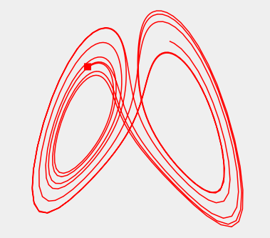

# DGLshow

A simple ode solver (Runge Kutta 4) with a simple Qt based
visualization.

A very rudimentary GUI and a few sample ode (from simple mechanics) are
included.

To edit the initial values (like mass, position, velocity, ...) the
source has to be edited -- currently.

# Example Visualization



# Build

Dependencies are Qt4 or Qt5. The program can be build with:

```
qmake; make
```
